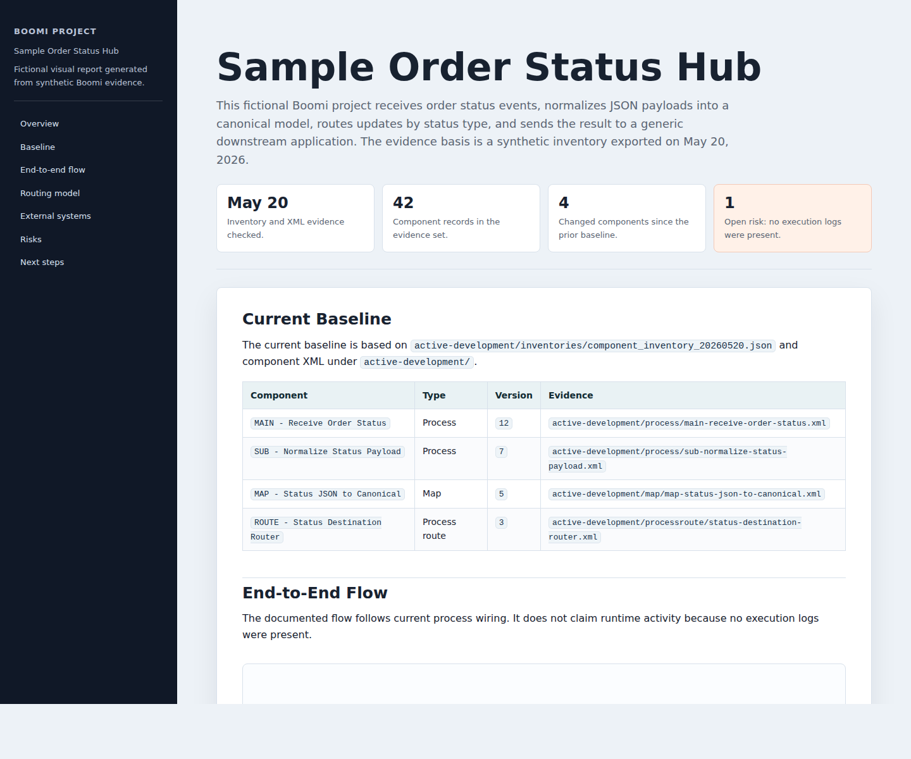

# Boomi Project Documenter skill

`boomi-project-documenter` is an AI agent skill for creating evidence-backed
documentation for Boomi integration projects. It guides an agent through
inspecting local Boomi component XML, API inventory exports, existing docs,
deployment evidence, execution logs, and test results before writing technical
Markdown and standalone visual HTML guides.

Use this skill when you need documentation that is accurate enough for technical
review and clear enough for stakeholders who don't read raw Boomi XML.

Current version: `1.0.1`

## Relationship to Boomi Companion

This skill works alongside
[Boomi Companion](https://github.com/OfficialBoomi/boomi-companion), the Boomi
plugin marketplace for discovering and installing Boomi development tools. Use
Boomi Companion for Boomi-oriented development tooling, skills, and companion
workflows. Use this skill when the task is specifically to document a Boomi
project from local evidence.

## What the skill creates

The skill helps an AI agent create or refresh these artifacts:

- A primary Markdown document that acts as the technical source of truth.
- Focused supporting Markdown docs when a topic needs its own page.
- A standalone visual HTML companion with embedded CSS, working navigation,
  status cards, tables, and inline SVG diagrams.
- Evidence notes that identify the current inventory, XML files, diff counts,
  deployment evidence, execution evidence, and verification checks used.
- Completion reports that list changed files, remaining risks, and checks that
  passed or could not run.

## Sample visual report

The repository includes a completed fictional visual report so you can see the
expected output shape.



## Why this skill exists

Boomi projects are easy to misdocument when an agent relies on old generated
files, stale pull folders, or component names without checking current IDs and
versions. This skill makes the agent start from evidence, classify claims, and
verify the output before calling the documentation complete.

The skill is intentionally generic. It does not include organization names,
organization-specific processes, internal paths, table names, endpoint names, or
business-specific examples.

## Repository layout

```text
boomi-project-documenter/
├── assets/
│   └── sample-generated-visual-report.png
├── SKILL.md
├── VERSION
├── references/
│   ├── evidence-and-verification.md
│   ├── example-prompts-and-reports.md
│   ├── markdown-documentation-template.md
│   ├── sample-generated-visual-report.html
│   └── visual-html-guide-template.html
└── scripts/
    └── validate_boomi_docs.py
```

## Skill contents

`SKILL.md` contains the core workflow. It tells an AI agent how to gather
evidence, separate current facts from historical notes and open risks, write
Markdown first, generate visual HTML second, and report verification results.

The `references/` directory contains reusable documentation patterns:

- `markdown-documentation-template.md` defines the recommended structure for
  the main Boomi project document.
- `visual-html-guide-template.html` provides a standalone, portable HTML guide
  template with embedded CSS and inline SVG patterns.
- `evidence-and-verification.md` defines evidence order, XML inspection checks,
  claim classification, stale-claim scans, and completion report structure.
- `example-prompts-and-reports.md` provides generic prompts, evidence notes,
  completion reports, and supporting-doc guidance.
- `sample-generated-visual-report.html` shows a completed fictional visual
  report with neutral Boomi component names and no organization-specific
  details.

The `scripts/` directory contains validation helpers:

- `validate_boomi_docs.py` checks generated Markdown and HTML for required
  sections, standalone HTML constraints, navigation anchors, tables, inline SVG,
  and print CSS.

## Installation

Install the skill by copying this repository directory into the skills directory
used by your AI agent runtime:

```bash
git clone https://github.com/burmjohn/boomi-project-documenter.git
cp -R boomi-project-documenter /path/to/agent-skills/
```

After installation, invoke it as `$boomi-project-documenter` in a compatible
agent environment.

### Common AI agent runtimes

Use the skill with any runtime that can load a folder-based skill, instruction
pack, or project-level agent guide.

| Runtime | Suggested install pattern | Notes |
| --- | --- | --- |
| Codex | `~/.codex/skills/boomi-project-documenter` | Uses `SKILL.md` directly. |
| Claude / Claude Code | Project-local skill or instructions directory | Use `SKILL.md` as the agent guide. |
| GitHub Copilot | `.github/copilot-instructions.md` | Add repository instructions that tell Copilot to use `SKILL.md`, `references/`, and `scripts/` when documenting Boomi projects. |
| OpenCode | Runtime-specific skills or instructions directory | Confirm the configured skills path. |
| PI Coding Agent | Project instructions or agent skills directory | Use the full `boomi-project-documenter/` folder when supported. |
| Antigravity | Project rules, agent instructions, or skills directory | Use `SKILL.md` as the primary instruction file. |
| Cursor / Windsurf | Project rules or agent instructions | Use `SKILL.md` as the source instructions if native skills are unsupported. |

If your runtime does not support folder-based skills, copy the contents of
`SKILL.md` into the runtime's project instructions and keep the `references/`
and `scripts/` paths available to the agent.

### GitHub Copilot

To use this workflow with GitHub Copilot, add repository custom instructions in
the target Boomi project:

```text
.github/copilot-instructions.md
```

In that file, tell Copilot to use this repository's `SKILL.md` as the primary
workflow for Boomi project documentation and to consult `references/` and
`scripts/` when generating or validating Markdown and standalone HTML reports.
Keep a copy of this skill repository available in the workspace, or paste the
contents of `SKILL.md` into the Copilot instructions file and preserve access to
the reference templates and validator script.

## Versioning

This project uses Semantic Versioning:

- Patch releases fix typos, validation bugs, examples, or wording without
  changing the expected documentation workflow.
- Minor releases add backward-compatible references, validators, examples, or
  workflow guidance.
- Major releases change the expected output contract, required evidence model,
  file layout, or validator behavior in a way that may require users to update
  their invocation or generated-document expectations.

The current release number is stored in `VERSION`, mirrored in `SKILL.md`, and
published with Git tags such as `v1.0.1`.

## Example prompt

```text
Use $boomi-project-documenter to create Markdown and standalone visual HTML
documentation for the Boomi project in this workspace.

Read the existing docs, current component XML, current API inventory with its
exact path and export date, prior baseline inventory, deployment evidence,
execution logs, and test results before writing. Preserve exact component IDs,
names, versions, folder paths, modified dates, operation names, profile names,
map names, and properties. Clearly separate current facts from historical notes,
unsupported inferences, and open risks. Do not claim runtime activity,
deployment status, production readiness, or zero dependency without direct
evidence. Follow `SKILL.md` for Documentation Levels and missing-evidence
fallback wording.
```

## Validation

Run the skill validator after editing the skill:

```bash
python3 /path/to/skill-creator/scripts/quick_validate.py .
```

Run the bundled HTML validator against the reference template:

```bash
python3 scripts/validate_boomi_docs.py \
  --html references/visual-html-guide-template.html
```

Run the bundled HTML validator against the generated sample report:

```bash
python3 scripts/validate_boomi_docs.py \
  --html references/sample-generated-visual-report.html
```

Run the validator against generated documentation:

```bash
python3 scripts/validate_boomi_docs.py \
  --markdown path/to/main-documentation.md \
  --html path/to/visual-guide.html
```

## Documentation standards

Documentation generated with this skill must meet these standards:

- Start from current inspectable evidence, not memory.
- Preserve exact Boomi component names, IDs, versions, folder paths, and modified
  dates when they matter.
- Use exact dates instead of relative wording.
- Label historical evidence and old failures as historical.
- Avoid unsupported claims about runtime activity, deployment status, production
  readiness, or zero dependencies.
- Keep Markdown as the source of truth.
- Keep HTML standalone, responsive, print-friendly, and free of external
  scripts, stylesheets, and images.
- Use visuals only when they explain real system behavior.

## Publishing checklist

Before publishing changes, run these checks:

1. Validate the skill frontmatter and required structure.
2. Run the bundled HTML validator on the visual reference template.
3. Search the repository for organization names, process names, table names,
   internal endpoints, and internal paths.
4. Confirm `VERSION`, `SKILL.md`, and the Git tag use the same release number.
5. Run `git diff --check`.

## Contributing

Issues, pull requests, corrections, and suggestions are welcome. Open an issue
for bugs, documentation gaps, unclear instructions, validation gaps, or ideas
for improving the skill. Submit pull requests for focused changes that keep the
skill generic, evidence-first, and free of organization-specific content.

We are open to contributions from Boomi users, integration developers,
documentation maintainers, and AI agent users who want to improve the workflow,
examples, validation checks, or runtime installation guidance.

## License

This project is licensed under the MIT License. See [LICENSE](LICENSE).
